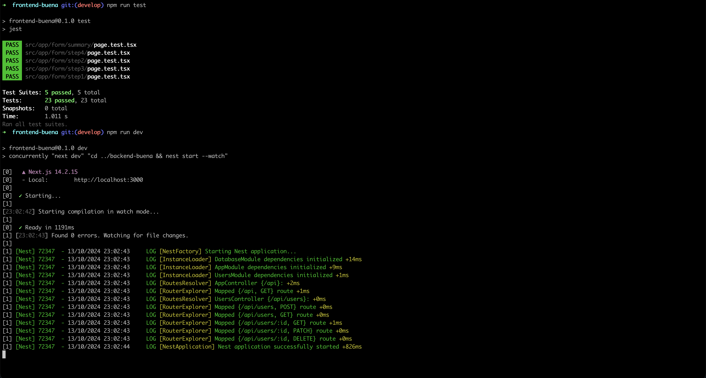
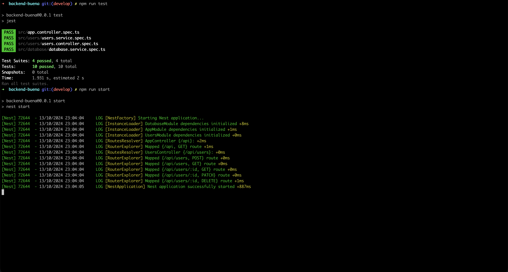
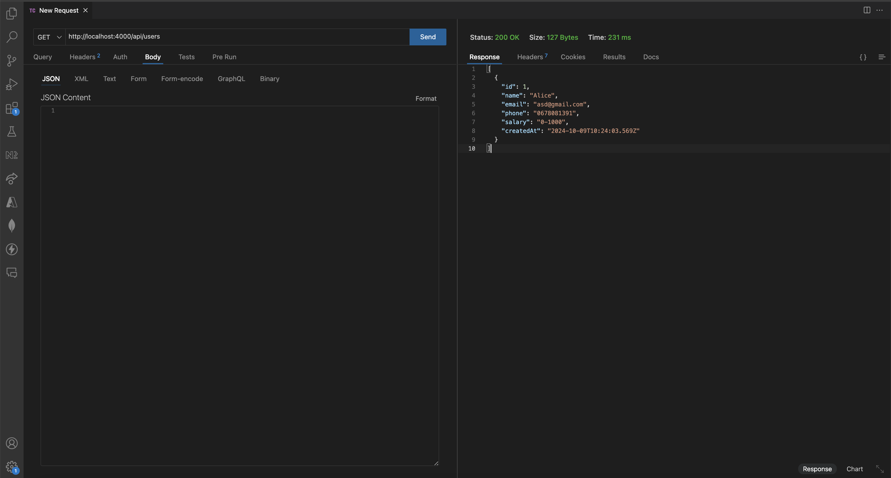
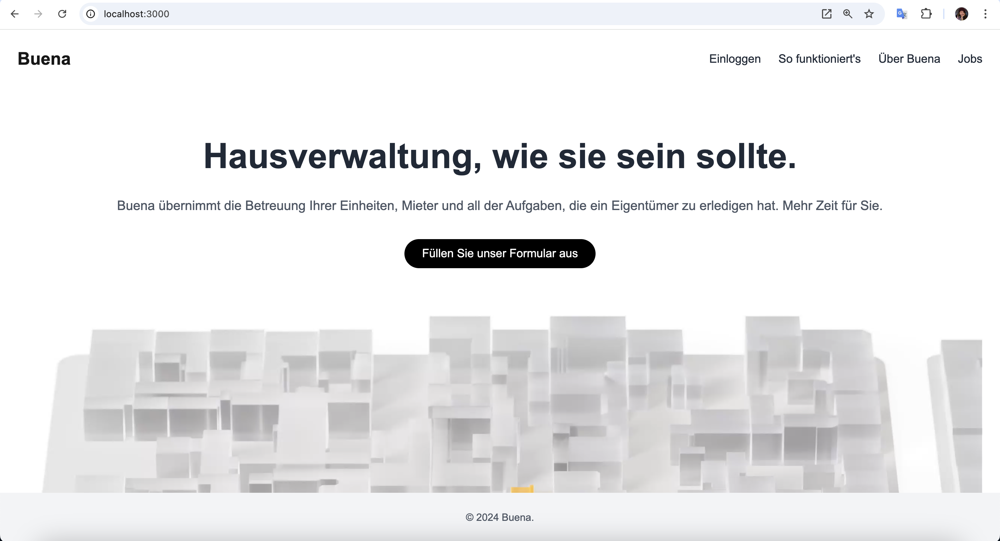
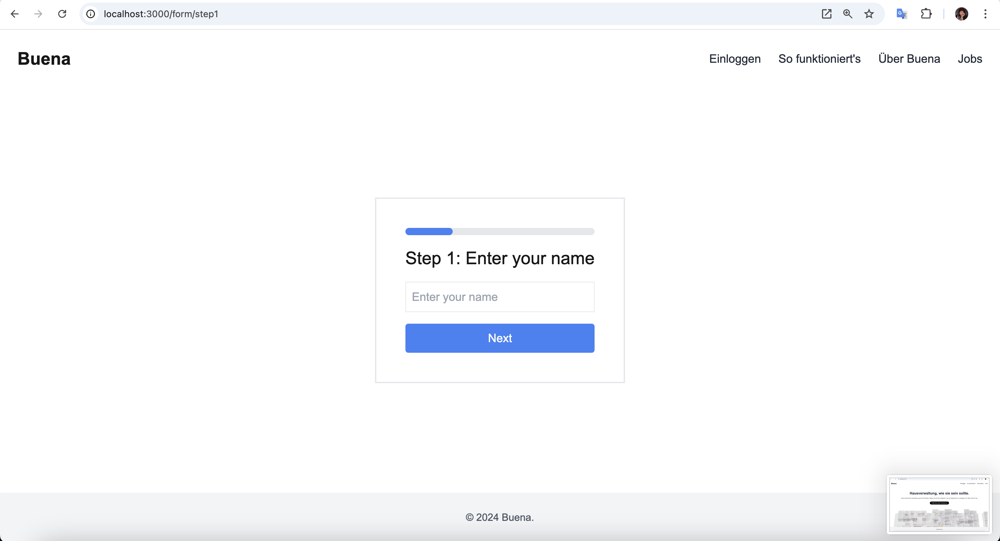
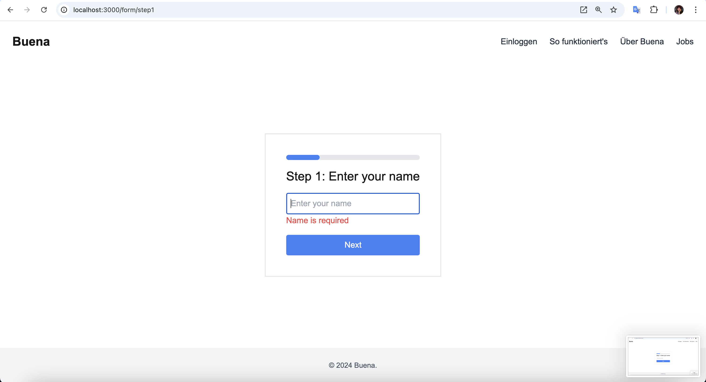

## Description

This project displays the Buena website. It contains backend & frontend and has for goal to showcase a multi-step form.

The main technology is:

- [NestJS](https://nestjs.com/)
- [Neon Postgres Database](https://console.neon.tech/)
- [Prisma](https://www.prisma.io/)
- [NextJS](https://nextjs.org/)
- [React](https://react.dev/)
- [Typescript](https://console.neon.tech/)

## Project setup

First you need to install the dependencies in both backend and frontend folders.

```bash
$ cd backend-buena

$ npm install

$ cd ../frontend-buena

$ npm install
```

This application uses [concurrently](https://www.npmjs.com/package/concurrently) to simultanously run backend and frontend.

To start the app, run the following command in the frontend folder:

```bash
$ npm run start
```

Open [http://localhost:3000](http://localhost:3000) with your browser to see the result.

The form is available at [http://localhost:3000/form/](http://localhost:3000/form/).

## Unit tests for frontend and backend

To run the tests, run the following command in the frontend or backend folder:

```bash
$ npm run test
```

## Screenshots







